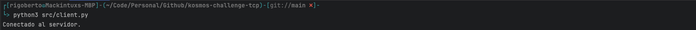
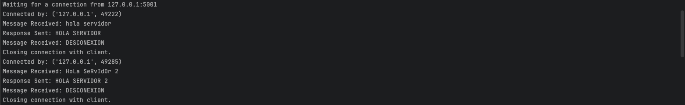

# Servidor y Cliente TCP en Python

## Descripción
Este proyecto implementa un servidor y un cliente TCP en Python. El servidor escucha en `localhost` en el puerto `5000` (cambiado por conflictos de puerto a `5001`) y responde a los mensajes en mayúsculas. Si recibe el mensaje "DESCONEXION", cierra la conexión con el cliente.

## Ejecución

### Ejecutar el Servidor
1. Abre una terminal y ejecuta:
   ```bash
   python src/server.py
   ```
   


### Ejecutar el Cliente
1. Abre otra terminal y ejecuta:
   ```bash
   python src/client.py
   ```



2. Ingresa un mensaje y presiona Enter. El servidor responderá con el mensaje en mayúsculas.
3. Para desconectarte, ingresa DESCONEXION.

## Pruebas Manuales

1. Enviar un mensaje de texto normal y verificar que el servidor responda en mayúsculas.


2. Enviar el mensaje DESCONEXION y confirmar que la conexión se cierra correctamente en ambos lados.


3. Intentar volver a conectarse con otro cliente, ejecutando nuevamente el paso 1.


4. Verificando la salida del servidor.



### Posible problema del puerto
En caso de contar con servicios o programas que se encuentran ejecutando algún proceso por medio del puerto ``5000`` podríamos simplemente cambiarlo dentro del código, o en su caso podríamos cerrar la tarea que se encuentra ejecutando dicho puerto.

Para poder identificar que se encuentra ejecutando dentro del puerto ```5000``` ejecutaríamos el siguiente comando:
   ```bash
   sudo lsof -i :5000 -P -n | grep LISTEN
   ```


